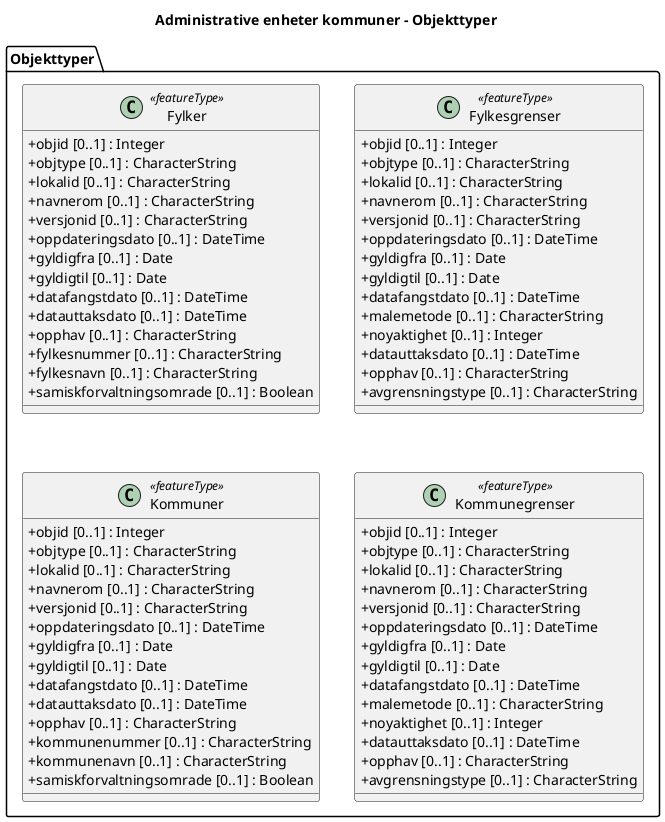

# Produktspesifikasjon: Administrative enheter kommuner

## Innledning, historikk og endringslogg

### Innledning

### Historikk

### Endringslogg

### Normative referanser

## Definisjoner og forkortelser

### Definisjoner

### Forkortelser

## Generelt om spesifikasjonen

### Unik identifisering

041f1e6e-bdbc-4091-b48f-8a5990f3cc5b

#### Fullstendig navn

Administrative enheter kommuner

#### Versjon

2006-07-01

### Referansedato

2025-07-04

### Ansvarlig organisasjon

Kartverket

### Språk

nor

### Hovedtema

Kommune, Administrativ inndeling, Administrative grenser, Kommunegrenser, Fylkesgrenser, Riksgrense, ABAS, Norge fastland, Administrative enheter, Det offentlige kartgrunnlaget, Inspire, geodataloven, Norge digitalt, beredskapsbase, dataNorgeNo, fellesDatakatalog, Basis geodata, Norge

### Temakategori

Administrative grenser

### Sammendrag

Datasettet viser kommuneinndelinga i landet med de mest nøyaktige grensene som er registrert digitalt og som er samlet i ett datasett. Datasettet har referansedato 1.7.2025, og er oppdatert med overføring av et areal mellom Sel og Vågå ved Liaskarven - Rudihøe, i tillegg til ei retting av kommunegrensa mellom Stavanger og Sola ved Liapynten.
 
Flatene inneholder egenskaper som forteller om offisielle kommunenumre. De offisielle norske, samiske og kvenske navnene for kommunene er hentet fra SSR. I tillegg finnes informasjon om samiske forvaltningsområder.

Geodataene er fra nasjonal inndelingsbase, som er en del av matrikkelen. Ved overgang til ny forvaltningsløsning, ble det også gjort endringer i UML-modellen.

### Formål

Framstille den offisielle kommuneinndelingen.

## Spesifikasjonsomfang

- **nivå**: dataset
- **utstrekning**: - **tidsmessig**: - **intervall**: - 2006-07-01, 2025-07-04
- **juridiske begrensninger**:
  - **useLimitation**: Ingen begrensninger på bruk er oppgitt. Se forøvrig lisens.
  - **tilgangsbegrensninger**: Åpne data
  - **bruksbegrensninger**: Lisens
  - **lisens**: Creative Commons BY 4.0 (CC BY 4.0)
  - **lisenslenke**: https://creativecommons.org/licenses/by/4.0/
  - **sikkerhetsbegrensninger**: Ugradert

## Innhold og struktur

- **bruk**: Forvaltningsmessig saksbehandling. Analyse og presentasjon i et GIS-system. Presentasjon av statistikk og analyser. Produksjon av kart og avledede produkter. Saksbehandling på lokalt og regionalt plan etter plan- og bygningsloven.

### Datamodell

== testtest

* 1
* 2
* 3

#### Fylker

Fylker 2024

Geometri:
- itemType: feature
- type: geometry-any
- crs:
  - http://www.opengis.net/def/crs/OGC/1.3/CRS84
  - http://www.opengis.net/def/crs/EPSG/0/3857

Egenskaper

| **Navn:** | **geometry** |
| --- | --- |
| Definisjon: | Elementtype: feature |
| Type: | geometry-any |
| OGC-rolle: | primary-geometry |

| **Navn:** | **objid** |
| --- | --- |
| Definisjon: | objid |
| Multiplisitet: | 0..1 |
| Type: | integer |

| **Navn:** | **objtype** |
| --- | --- |
| Definisjon: | objtype |
| Multiplisitet: | 0..1 |
| Type: | string |

| **Navn:** | **lokalid** |
| --- | --- |
| Definisjon: | lokalid |
| Multiplisitet: | 0..1 |
| Type: | string |

| **Navn:** | **navnerom** |
| --- | --- |
| Definisjon: | navnerom |
| Multiplisitet: | 0..1 |
| Type: | string |

| **Navn:** | **versjonid** |
| --- | --- |
| Definisjon: | versjonid |
| Multiplisitet: | 0..1 |
| Type: | string |

| **Navn:** | **oppdateringsdato** |
| --- | --- |
| Definisjon: | oppdateringsdato |
| Multiplisitet: | 0..1 |
| Type: | date-time (string) |

| **Navn:** | **gyldigfra** |
| --- | --- |
| Definisjon: | gyldigfra |
| Multiplisitet: | 0..1 |
| Type: | date (string) |

| **Navn:** | **gyldigtil** |
| --- | --- |
| Definisjon: | gyldigtil |
| Multiplisitet: | 0..1 |
| Type: | date (string) |

| **Navn:** | **datafangstdato** |
| --- | --- |
| Definisjon: | datafangstdato |
| Multiplisitet: | 0..1 |
| Type: | date-time (string) |

| **Navn:** | **datauttaksdato** |
| --- | --- |
| Definisjon: | datauttaksdato |
| Multiplisitet: | 0..1 |
| Type: | date-time (string) |

| **Navn:** | **opphav** |
| --- | --- |
| Definisjon: | opphav |
| Multiplisitet: | 0..1 |
| Type: | string |

| **Navn:** | **fylkesnummer** |
| --- | --- |
| Definisjon: | fylkesnummer |
| Multiplisitet: | 0..1 |
| Type: | string |
| OGC-rolle: | id |

| **Navn:** | **fylkesnavn** |
| --- | --- |
| Definisjon: | fylkesnavn |
| Multiplisitet: | 0..1 |
| Type: | string |

| **Navn:** | **samiskforvaltningsomrade** |
| --- | --- |
| Definisjon: | samiskforvaltningsomrade |
| Multiplisitet: | 0..1 |
| Type: | boolean |

#### Fylkesgrenser

Fylkesgrenser 2024

Geometri:
- itemType: feature
- type: geometry-any
- crs:
  - http://www.opengis.net/def/crs/OGC/1.3/CRS84
  - http://www.opengis.net/def/crs/EPSG/0/3857

Egenskaper

| **Navn:** | **geometry** |
| --- | --- |
| Definisjon: | Elementtype: feature |
| Type: | geometry-any |
| OGC-rolle: | primary-geometry |

| **Navn:** | **objid** |
| --- | --- |
| Definisjon: | objid |
| Multiplisitet: | 0..1 |
| Type: | integer |
| OGC-rolle: | id |

| **Navn:** | **objtype** |
| --- | --- |
| Definisjon: | objtype |
| Multiplisitet: | 0..1 |
| Type: | string |

| **Navn:** | **lokalid** |
| --- | --- |
| Definisjon: | lokalid |
| Multiplisitet: | 0..1 |
| Type: | string |

| **Navn:** | **navnerom** |
| --- | --- |
| Definisjon: | navnerom |
| Multiplisitet: | 0..1 |
| Type: | string |

| **Navn:** | **versjonid** |
| --- | --- |
| Definisjon: | versjonid |
| Multiplisitet: | 0..1 |
| Type: | string |

| **Navn:** | **oppdateringsdato** |
| --- | --- |
| Definisjon: | oppdateringsdato |
| Multiplisitet: | 0..1 |
| Type: | date-time (string) |

| **Navn:** | **gyldigfra** |
| --- | --- |
| Definisjon: | gyldigfra |
| Multiplisitet: | 0..1 |
| Type: | date (string) |

| **Navn:** | **gyldigtil** |
| --- | --- |
| Definisjon: | gyldigtil |
| Multiplisitet: | 0..1 |
| Type: | date (string) |

| **Navn:** | **datafangstdato** |
| --- | --- |
| Definisjon: | datafangstdato |
| Multiplisitet: | 0..1 |
| Type: | date-time (string) |

| **Navn:** | **malemetode** |
| --- | --- |
| Definisjon: | malemetode |
| Multiplisitet: | 0..1 |
| Type: | string |

| **Navn:** | **noyaktighet** |
| --- | --- |
| Definisjon: | noyaktighet |
| Multiplisitet: | 0..1 |
| Type: | integer |

| **Navn:** | **datauttaksdato** |
| --- | --- |
| Definisjon: | datauttaksdato |
| Multiplisitet: | 0..1 |
| Type: | date-time (string) |

| **Navn:** | **opphav** |
| --- | --- |
| Definisjon: | opphav |
| Multiplisitet: | 0..1 |
| Type: | string |

| **Navn:** | **avgrensningstype** |
| --- | --- |
| Definisjon: | avgrensningstype |
| Multiplisitet: | 0..1 |
| Type: | string |

#### Kommuner

Kommuner 2024

Geometri:
- itemType: feature
- type: geometry-any
- crs:
  - http://www.opengis.net/def/crs/OGC/1.3/CRS84
  - http://www.opengis.net/def/crs/EPSG/0/3857

Egenskaper

| **Navn:** | **geometry** |
| --- | --- |
| Definisjon: | Elementtype: feature |
| Type: | geometry-any |
| OGC-rolle: | primary-geometry |

| **Navn:** | **objid** |
| --- | --- |
| Definisjon: | objid |
| Multiplisitet: | 0..1 |
| Type: | integer |

| **Navn:** | **objtype** |
| --- | --- |
| Definisjon: | objtype |
| Multiplisitet: | 0..1 |
| Type: | string |

| **Navn:** | **lokalid** |
| --- | --- |
| Definisjon: | lokalid |
| Multiplisitet: | 0..1 |
| Type: | string |

| **Navn:** | **navnerom** |
| --- | --- |
| Definisjon: | navnerom |
| Multiplisitet: | 0..1 |
| Type: | string |

| **Navn:** | **versjonid** |
| --- | --- |
| Definisjon: | versjonid |
| Multiplisitet: | 0..1 |
| Type: | string |

| **Navn:** | **oppdateringsdato** |
| --- | --- |
| Definisjon: | oppdateringsdato |
| Multiplisitet: | 0..1 |
| Type: | date-time (string) |

| **Navn:** | **gyldigfra** |
| --- | --- |
| Definisjon: | gyldigfra |
| Multiplisitet: | 0..1 |
| Type: | date (string) |

| **Navn:** | **gyldigtil** |
| --- | --- |
| Definisjon: | gyldigtil |
| Multiplisitet: | 0..1 |
| Type: | date (string) |

| **Navn:** | **datafangstdato** |
| --- | --- |
| Definisjon: | datafangstdato |
| Multiplisitet: | 0..1 |
| Type: | date-time (string) |

| **Navn:** | **datauttaksdato** |
| --- | --- |
| Definisjon: | datauttaksdato |
| Multiplisitet: | 0..1 |
| Type: | date-time (string) |

| **Navn:** | **opphav** |
| --- | --- |
| Definisjon: | opphav |
| Multiplisitet: | 0..1 |
| Type: | string |

| **Navn:** | **kommunenummer** |
| --- | --- |
| Definisjon: | kommunenummer |
| Multiplisitet: | 0..1 |
| Type: | string |
| OGC-rolle: | id |

| **Navn:** | **kommunenavn** |
| --- | --- |
| Definisjon: | kommunenavn |
| Multiplisitet: | 0..1 |
| Type: | string |

| **Navn:** | **samiskforvaltningsomrade** |
| --- | --- |
| Definisjon: | samiskforvaltningsomrade |
| Multiplisitet: | 0..1 |
| Type: | boolean |

#### Kommunegrenser

Kommunegrenser 2024

Geometri:
- itemType: feature
- type: geometry-any
- crs:
  - http://www.opengis.net/def/crs/OGC/1.3/CRS84
  - http://www.opengis.net/def/crs/EPSG/0/3857

Egenskaper

| **Navn:** | **geometry** |
| --- | --- |
| Definisjon: | Elementtype: feature |
| Type: | geometry-any |
| OGC-rolle: | primary-geometry |

| **Navn:** | **objid** |
| --- | --- |
| Definisjon: | objid |
| Multiplisitet: | 0..1 |
| Type: | integer |
| OGC-rolle: | id |

| **Navn:** | **objtype** |
| --- | --- |
| Definisjon: | objtype |
| Multiplisitet: | 0..1 |
| Type: | string |

| **Navn:** | **lokalid** |
| --- | --- |
| Definisjon: | lokalid |
| Multiplisitet: | 0..1 |
| Type: | string |

| **Navn:** | **navnerom** |
| --- | --- |
| Definisjon: | navnerom |
| Multiplisitet: | 0..1 |
| Type: | string |

| **Navn:** | **versjonid** |
| --- | --- |
| Definisjon: | versjonid |
| Multiplisitet: | 0..1 |
| Type: | string |

| **Navn:** | **oppdateringsdato** |
| --- | --- |
| Definisjon: | oppdateringsdato |
| Multiplisitet: | 0..1 |
| Type: | date-time (string) |

| **Navn:** | **gyldigfra** |
| --- | --- |
| Definisjon: | gyldigfra |
| Multiplisitet: | 0..1 |
| Type: | date (string) |

| **Navn:** | **gyldigtil** |
| --- | --- |
| Definisjon: | gyldigtil |
| Multiplisitet: | 0..1 |
| Type: | date (string) |

| **Navn:** | **datafangstdato** |
| --- | --- |
| Definisjon: | datafangstdato |
| Multiplisitet: | 0..1 |
| Type: | date-time (string) |

| **Navn:** | **malemetode** |
| --- | --- |
| Definisjon: | malemetode |
| Multiplisitet: | 0..1 |
| Type: | string |

| **Navn:** | **noyaktighet** |
| --- | --- |
| Definisjon: | noyaktighet |
| Multiplisitet: | 0..1 |
| Type: | integer |

| **Navn:** | **datauttaksdato** |
| --- | --- |
| Definisjon: | datauttaksdato |
| Multiplisitet: | 0..1 |
| Type: | date-time (string) |

| **Navn:** | **opphav** |
| --- | --- |
| Definisjon: | opphav |
| Multiplisitet: | 0..1 |
| Type: | string |

| **Navn:** | **avgrensningstype** |
| --- | --- |
| Definisjon: | avgrensningstype |
| Multiplisitet: | 0..1 |
| Type: | string |

## Referansesystem

- **romlige referansesystemer**:
  - **kode**: EPSG:25832
    - **navn**: EUREF89 UTM sone 32, 2d
  - **kode**: EPSG:25833
    - **navn**: EUREF89 UTM sone 33, 2d
  - **kode**: EPSG:25835
    - **navn**: EUREF89 UTM sone 35, 2d
  - **kode**: EPSG:3035
    - **navn**: EUREF89 / ETRS89-LAEA Europe
  - **kode**: EPSG:4258
    - **navn**: EUREF 89 Geografisk (ETRS 89) 2d
  - **kode**: EPSG:25832
    - **navn**: EUREF89 UTM sone 32, 2d
- **romlig representasjonstype**: Vektor

## Kvalitet

- **nivå**: dataset
- **navn**: COMMISSION REGULATION (EU) No 1089/2010 of 23 November 2010 implementing Directive 2007/2/EC of the European Parliament and of the Council as regards interoperability of spatial data sets and services
  - **måleparameter**: Dataene er i henhold til produktspesifikasjonen
- **navn**: SOSI produktspesifikasjon: Administrative enheter Norge
  - **måleparameter**: Dataene er i henhold til produktspesifikasjonen
- **navn**: Sosi applikasjonsskjema
  - **måleparameter**: SOSI-filer er i henhold til applikasjonsskjema
- **navn**: Sosi applikasjonsskjema
  - **måleparameter**: GML-filer er i henhold til applikasjonsskjema
- **navn**: Prosentvis dekning i forhold til datasettets utstrekning
  - **måleparameter**: Datasettets faktiske kartlagte areal i forhold til datasettets spesifiserte utstrekning
  - **resultat**: 100
- **navn**: Prosentvis oppfyllelse av FAIR-prinsipper
  - **måleparameter**: Angir fullstendighet i forhold til krav fra FAIR-prinsippene (The FAIR Guiding Principles for scientific data management and stewardship)
  - **resultat**: 96
- **navn**: FAIR
  - **resultat**: Prosentvis oppfyllelse av FAIR-prinsipper: 96%
- **navn**: Coverage
  - **resultat**: Prosentvis dekning i forhold til datasettets utstrekning: 100%
- **beskrivelse**: Trenger du hjelp til å laste ned og ta i bruk Kartverkets data og tjenester? På kartverket.no finner du tips og veiledning.

## Datafangst

## Datavedlikehold

Etter behov
Forvaltningsmessig saksbehandling. Analyse og presentasjon i et GIS-system. Presentasjon av statistikk og analyser. Produksjon av kart og avledede produkter. Saksbehandling på lokalt og regionalt plan etter plan- og bygningsloven.

## Presentasjon

## Leveranse

- **distribusjoner**:
  - **format**: - **format**: GEONORGE:DOWNLOAD
    - **tilgang**:
      - **lenke**: https://nedlasting.geonorge.no/api/capabilities/
      - **protokoll**: GEONORGE:DOWNLOAD
  - **tittel**: Geonorge nedlastning
    - **format**: - **format**: Geonorge nedlastning
    - **tilgang**:
      - **lenke**: https://nedlasting.geonorge.no/api/capabilities/
      - **protokoll**: GEONORGE:DOWNLOAD
  - **tittel**: Administrative enheter WMS
    - **format**: - **format**: png
    - **tilgang**:
      - **lenke**: https://wms.geonorge.no/skwms1/wms.adm_enheter2?service=wms&request=GetCapabilities
      - **protokoll**: WMS-tjeneste
      - **lisens**: Åpne data
    - **notater**: Tjeneste

## Metadata

- **standard**: ISO19115
- **standardversjon**: 2003
- **metadatadato**: 2025-10-31
- **språk**: nor
- **kontaktpunkt**:
  - **organisasjon**: Kartverket
  - **epost**: post@kartverket.no
  - **rolle**: pointOfContact
- **identifikatorer**:
  - **myndighet**: geonorge
    - **kode**: 041f1e6e-bdbc-4091-b48f-8a5990f3cc5b
- **metadatalenke**: https://www.geonorge.no/geonetwork/srv/nor/csw?service=CSW&request=GetRecordById&version=2.0.2&outputSchema=http://www.isotc211.org/2005/gmd&elementSetName=full&id=041f1e6e-bdbc-4091-b48f-8a5990f3cc5b
